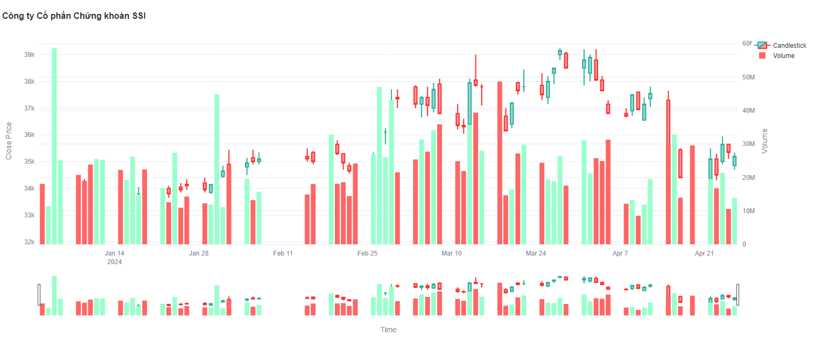
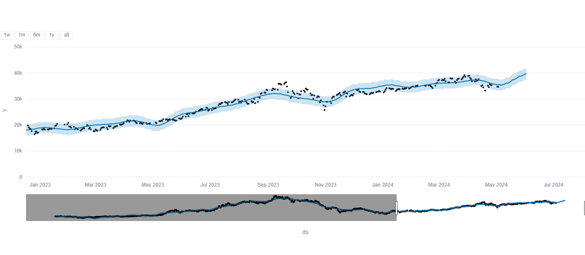
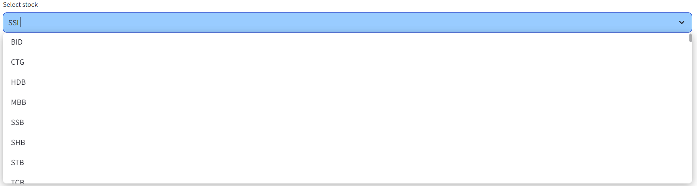
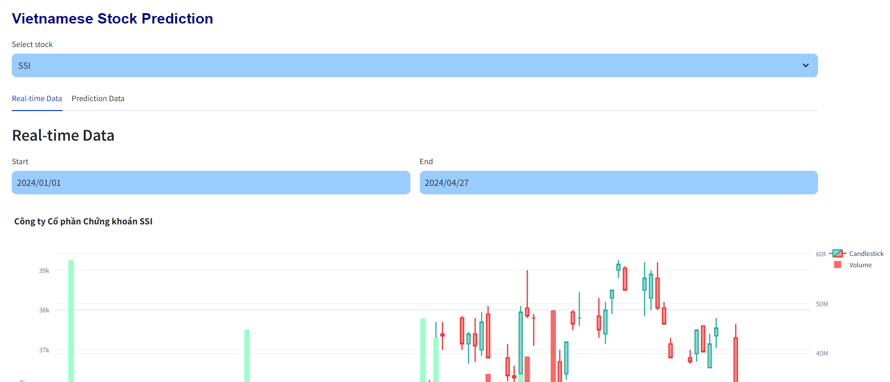
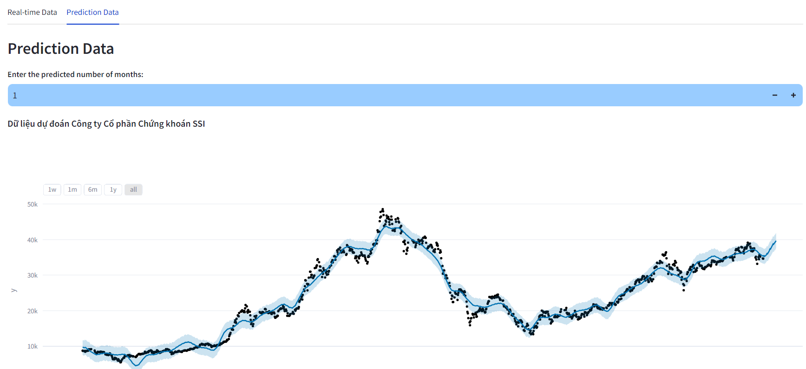

# Vietnamese Stock Prediction

[Web App](https://vn-stock-prediction.streamlit.app/)

## **The Summary**

**Conclusion**:
Through the implementation of the Prophet algorithm, the project successfully generated stock price predictions with relative accuracy.  

**Challenges**:
During the development process, some difficulties were encountered. One of the main challenges is collecting and pre-processing relevant historical stock data. Ensuring data quality and consistency is critical for accurate forecasting.  

**Techniques**:
- *Data Retrieval*: The project uses the "vnstock" library to retrieve stock data in the Vietnamese market.

- *Data Cleaning and Transformation*: The "pandas" and "numpy" libraries were employed to clean and transform the retrieved data. These libraries offered powerful tools for handling missing values, removing duplicates, and performing necessary data manipulations to prepare the dataset for analysis.

- *Prophet Algorithm*: The project utilized the "Prophet" algorithm for stock price prediction. It is designed to handle various components of time series data, such as trends, seasonality, and holidays.

- *Streamlit Deployment*: The project leveraged the "streamlit" framework to deploy the code as a web application. Streamlit simplified the process of converting the code into an interactive web interface, allowing users to easily access and utilize the stock price prediction system.


## **Step by step**

### **Data**:  
Create a function to retrieve stock data from the *vnstock* library:
```
def load_data(ticker):
    START = "2020-01-01"
    TODAY = date.today().strftime("%Y-%m-%d")
    data = vn.stock_historical_data(ticker, START, TODAY)    
    return data
```
Candlestick chart:
```
fig = candlestick_chart(filtered_data, show_volume=True,
            title=organ_name, x_label='Time', y_label='Close Price',
            colors=('#99FFCC', '#FF6666'))
```


### **Prophet model**:  
Training data:
```
m = Prophet()
m.fit(df_train)
future = m.make_future_dataframe(period)
forecast = m.predict(future)
```
*period*: predicted number of days 

Prediction chart:
`filtered_fig = plot_plotly(m, forecast)`  



### **Streamlit deployment**:  
The project is divided into 2 tabs:
- Real-time Data: Actual data of stocks in the Vietnamese market.
- Prediction Data: Prediction data using the Prophet model of stocks.

Create selectbox to select stocks:  
 `selected_stock = st.selectbox('Select stock', stocks)`;  
  *stocks*: danh sách các mã cổ phiếu tại Việt Nam.



Create 2 tabs: `tab1, tab2= st.tabs(["Real-time Data", "Prediction Data"])`
  
- Tab **"Real-time Data"**: 
Add date filter:
```
col1, col2 = st.columns([0.5, 0.5])
with col1:
    start_date = st.date_input("Start", min_value=date(2020, 1, 1), max_value=date.today(), key="start_date", value=date(2023, 1, 1))
with col2:
    end_date = st.date_input("End", min_value=date(2020, 1, 1), max_value=date.today(), key="end_date")
``` 


- Tab **"Prediction Data"**: 
Add predicted month number button:  
 `n_months = st.number_input("**Enter the predicted number of months:**", value=1, step=1)`  



Deploy from Github to Streamlit: [Web App](https://vn-stock-prediction.streamlit.app/)